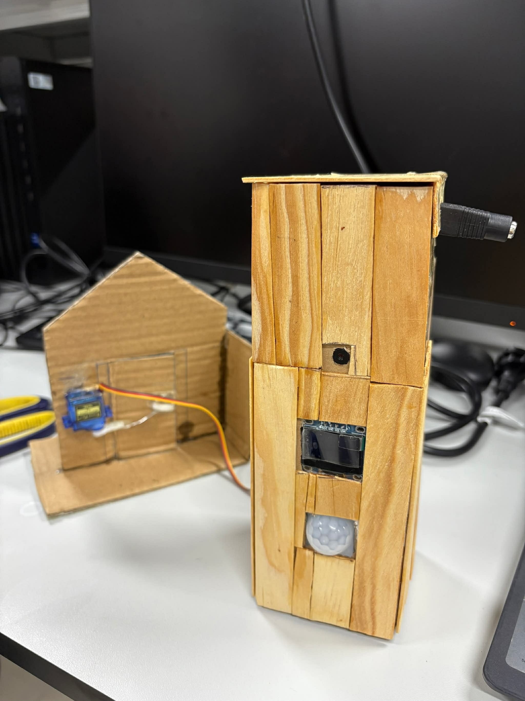

# 顔認証勤怠管理・ドアアクセス制御システム (Face Recognition Attendance System)

## 📖 概要 (Project Overview)
本プロジェクトは、IoT技術とAIを融合させた「スマートオフィス」ソリューションです。従来の指紋認証やカード認証が抱える衛生面の問題やなりすましのリスクを解消し、安価なハードウェアで商用レベルの顔認証・入退室管理・勤怠記録の自動化を「2 in 1」で実現しました。

---

## 🚀 主な特徴 (Key Features)
* **高度なAIアルゴリズム:** **InsightFace (ArcFace)** を採用し、斜めの顔や低照度環境下でも 99% 以上の高い認識精度を実現しました。
* **リアルタイム処理 (FreeRTOS):** ESP32 上で **FreeRTOS** を活用し、ビデオストリーミング、サーボ制御、OLED表示などのマルチタスクを遅延なく並列処理します。
* **エッジ・クラウド連携:** AI処理の負荷をサーバー側へ集約し、デバイス側 (ESP32) をデータ収集と制御に特化させることで、システム全体のパフォーマンスを最適化しました。
* **圧倒的なコストパフォーマンス:** 総ハードウェアコストを 1,000,000 VND (約 6,000 円) 以下に抑えつつ、実用的な応答速度 (5 秒未満) を達成しました。

---

## 🛠️ システム構成 (System Architecture)
本システムは、IoT クライアント・サーバーモデルに基づいています：

1.  **Client (Device):** ESP32-CAM を使用し、画像取得、人感センサー (PIR) 検知、ドアロック制御 (Servo) を実行します。
2.  **Server (Processing):** Python 環境。WiFi 経由で映像を受信し、顔認証処理を行って制御コマンドをクライアントに返信します。
3.  **Web App:** 従業員管理、ライブ映像監視、入退室ログ確認用の直感的なインターフェースを提供します。

---

## 🧰 ハードウェア構成 (Hardware)
| コンポーネント | モデル | 主な機能 |
| :--- | :--- | :--- |
| メインプロセッサ | ESP32-DevKit V1 | メイン制御、WiFi 通信、FreeRTOS 実行 |
| カメラモジュール | ESP32-CAM (OV2640) | 画像取得、ビデオストリーミング |
| 人感センサー | PIR HC-SR501 | システムのウェイクアップ検知 |
| ディスプレイ | OLED 0.96" (SSD1306) | ステータス・氏名表示 (I2C) |
| モーター | Servo SG90 | ドアロック機構の開閉制御 |

---

## 💻 技術スタック (Tech Stack)
### Embedded (ESP32)
* **Framework:** Arduino IDE / ESP-IDF
* **OS:** **FreeRTOS** (Task: Camera, Servo, WiFi)
* **Protocol:** HTTP, WebSocket

### Computer Vision & AI (Server)
* **Core AI:** **InsightFace (ArcFace)** - 顔特徴抽出 (512-D vector)
* **Face Detection:** SCRFD / MobileFaceNet
* **Database:** SQLite/MySQL (特徴量ベクトル、勤怠ログ保存)

---

## 📊 実験結果 (Experimental Results)
* **認識精度:** 99% 以上 (InsightFace 採用).
* **応答速度:** LAN 環境下でドア解錠まで 5 秒未満.
* **安定性:** FreeRTOS のタスク管理と Watchdog タイマーにより、長時間の連続稼働を確認済み.

---

## 📸 System Preview
### System Architecture

### Software Flowchart

### Actual Results

## 👥 チームメンバー (Team Members)
**ハノイ工科大学 (HUST) - マイクロプロセッサ工学クラス:**
* **Nguyễn Minh Hùng** (20234011): 組み込み開発 (FreeRTOS, Servo, OLED)
* **Nguyễn Quốc Huy** (20234013): システム設計、ドキュメント作成
* **Phan Nguyễn Mạnh Lợi** (20234020): ハードウェア設計、回路製作
* **Hoàng Tuấn Ngọc** (20234028): AI モデル開発、サーバー & Web アプリ構築

**指導教員:** Hàn Huy Dũng 博士
